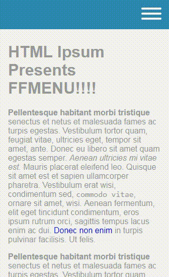

# FF Responsive Menu

A simple swipe enabled menu. Swipe from the edge to open the menu.

##### Demo
[https://xsonic.github.io/ff-responsive-menu/demo/](https://xsonic.github.io/ff-responsive-menu/demo/)
(Make sure to test the demo on a touch enabled device or with chrome's dev-tools)

### Installation

*coming soon*